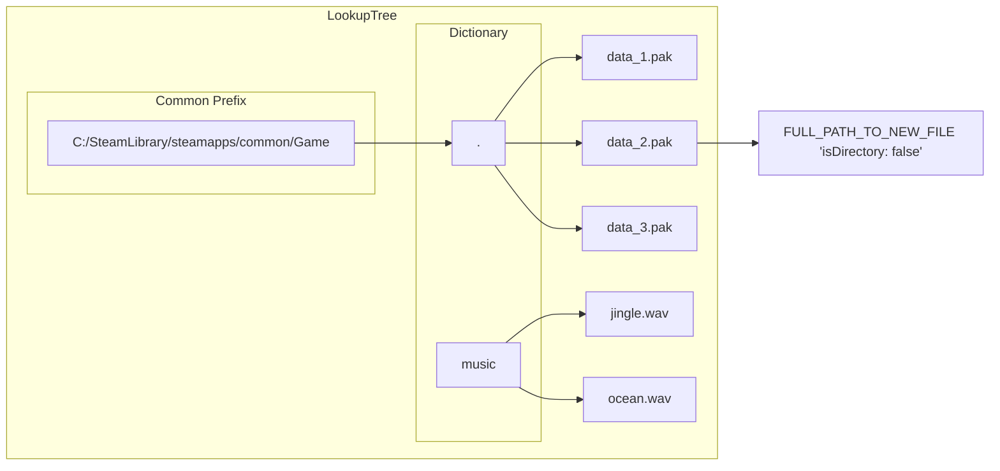

# Lookup Tree

!!! tip

    This is a visualization of the data structure used to map paths of old files to new files ***after*** all mods are loaded during startup.
    When all mods are loaded, this structure is generated from the [Redirection Tree](./redirection-tree.md).

This is a data structure with O(3) lookup time that uses the following strategy:  
- Check common prefix.  
- Check remaining path in dictionary.  
- Check file name in dictionary.

Use of prefix is based on the idea that a game will have all of its files stored under a common folder path.
We use this to save memory in potentially huge games.  



## In Code

```csharp
/// <summary>
/// A version of <see cref="RedirectionTree"/> optimised for faster lookups in the scenario of use with game folders.
/// </summary>
public struct LookupTree<TTarget>
{
    /// <summary>
    /// Prefix of all paths.
    /// Stored in upper case for faster performance.
    /// </summary>
    public string Prefix { get; private set; }
    
    /// <summary>
    /// Dictionary that maps individual subfolders to map of files.
    /// </summary>
    public SpanOfCharDict<SpanOfCharDict<TTarget>> SubfolderToFiles { get; private set; }
}
```