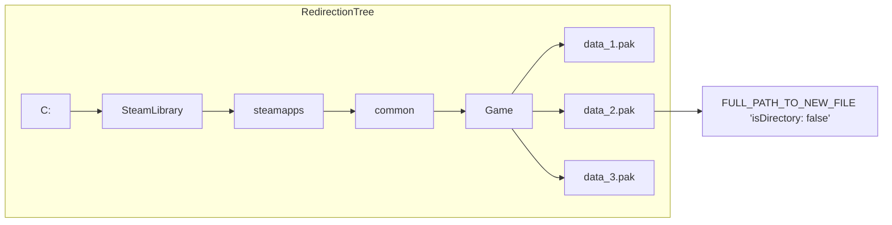

# Redirection Tree

!!! tip

    This is a visualization of the data structure used to map paths of old files to new files as the mods are loading during startup.


This is a data structure with O(N) lookup time (where N is the number of
components separated by '/') that make up the final file path. It uses the 
following resolution steps:  

- Start at tree root.  
- Split the input path on '/' character.  
- Traverse the tree one level at a time, using each split component to move down next level.  
- At each level check if there's a child node corresponding to current path component.  
    - If there is no child node, lookup has failed and path is not in the tree.  
- When all components have been consumed, check the `Items` dictionary of the final node reached to see if the path is present.  
- If it is, the lookup succeeds and the corresponding value is returned. If it is not, the lookup fails and the path is not found in the tree.  

When all mods are loaded, this [trie](https://en.wikipedia.org/wiki/Trie) is converted to a [Lookup Tree](./lookup-tree.md).



## In Code

```csharp
/// <summary>
/// Represents that will be used for performing redirections.
/// </summary>
public struct RedirectionTree<TTarget>
{
    /// <summary>
    /// Root nodes, e.g. would store drive: C:/D:/E: etc.
    /// In most cases there is only one.
    /// </summary>
    public RedirectionTreeNode<TTarget> RootNode { get; private set; }
}
```

```csharp
/// <summary>
/// Individual node in the redirection tree.
/// </summary>
public struct RedirectionTreeNode<TTarget>
{
    /// <summary>
    /// Child nodes of this nodes.
    /// i.e. Maps 'folder' to next child.
    /// </summary>
    public SpanOfCharDict<RedirectionTreeNode<TTarget>> Children;

    /// <summary>
    /// Files present at this level of the tree.
    /// </summary>
    public SpanOfCharDict<TTarget> Items;
}
```

```csharp
/// <summary>
/// Target for a file covered by the redirection tree.
/// </summary>
public struct RedirectionTreeTarget
{
    /// <summary>
    /// Path to the directory storing the file.
    /// </summary>
    public string Directory; // (This is deduplicated, saving memory)
    
    /// <summary>
    /// Name of the file in the directory.
    /// </summary>
    public string FileName;

    /// <summary>
    /// True if this is a directory, else false.
    /// </summary>
    public bool IsDirectory;
}
```